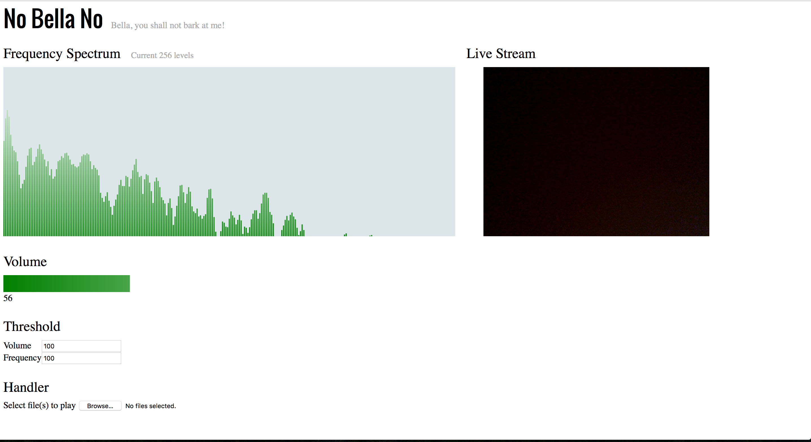

# No Bella No

This is used to train Bella, my puppy.
Bella barks when I am not with her, so annoying. I'd like to play a audio saying 'NO Bella!' when she barks because she is at least trained to understand 'No'. I use web audio apis to build this fun project.

## How to use
1. Git clone this project
2. Go to the directory
3. Use a web server to serve it. For example, `python -m SimpleHTTPServer`
4. Open Firefox and go to `0.0.0.0:8000` (this may vary)
5. Select audio file(s) you want to play when threshold meets
6. Set volume and frequency threshold. Notice frequncy has 256 level only.

## Future work
1. Use the live stream. Currently it is not working. Ideally, I want to take a screenshot when threhold meets.